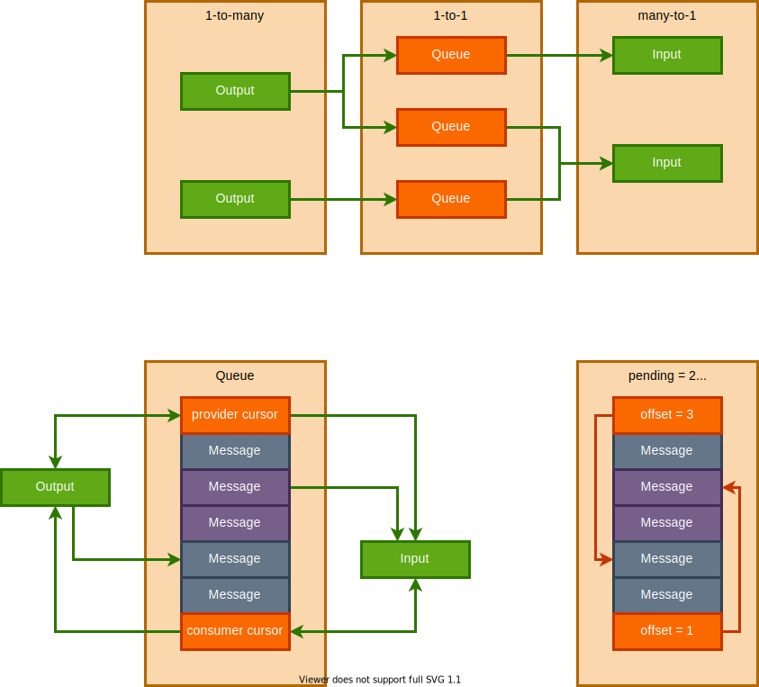

# Go.d

Thread-pooled coroutines with [wait-free](https://en.wikipedia.org/wiki/Non-blocking_algorithm#Wait-freedom) staticaly typed autofinalizable communication channels.

# Features

* Static typed channels (but you can use [std.variant](https://dlang.org/library/std/variant.html) to transfer various data).
* Minimal message size (no additional memory cost).
* Wait free channels (but if you don't check for available/pending you will be blocked).
* Static check for message transition safety (allowed only shared, immutable and non-copyable).
* Every goroutine is thread with 4KB stack now (Fibers will be supported later).
* Automatic finalizing queues on channel scope exit (use `empty`/`ignore` to check it).

# Benchmarks

```
> ./compare

>go run app.go --release
Workers Result          Time
8       49995000000     109.7644ms
>dub --quiet --build=release
Workers Result          Time
0       49995000000     124 ms
```

# Moduels

- **[mem](source/jin/go/mem.d)** - Various memory constants
- **[cursor](source/jin/go/cursor.d)** - Atomic buffer cursor with finalization support
- **[queue](source/jin/go/queue.d)** - Low level 1p1c wait-free queue (prefer to use channels)
- **[channel](source/jin/go/channel.d)** - Common channels logic
- **[input](source/jin/go/input.d)** - Round-robin wait-free mp1c input channel
- **[output](source/jin/go/output.d)** - Round-robin wait-free 1pmc output channel
- **[go](source/jin/go/go.d)** - Goroutine starters
- **[await](source/jin/go/await.d)** - Yield lock for goroutines

# Internals



# Usage

dub.json:
```json
{
	"dependencies": {
		"jin-go": "~>2.0"
	}
}
```

More actual examples in unit tests.

## Import
```d
import jin.go;
```

## Create channels

```d
struct Data { int val }
struct Error { string msg }
alias Algebraic!(Data,Error) Message 

Input!Message messages_input;
auto messages_output = messages_input.pair;
auto messages_input2 = messages_output.pair;

Input!int ints_in;
Output!int ints_out;
```

## Start goroutines

```d
void incrementing( Output!int ints_out , Input!int ints_in ) {
	while( ints_out.available >= 0 ) {
		ints_out.put( ints_in.next + 1 );
	}
}

go!incrementing( ints_in.pair , ints_out.pair );
auto ints_in = go!incrementing( ints_out.pair ); // ditto

auto squaring( int limit ) {
	return limit.iota.map( i => i^^2 );
}
auto squares_in = go!squaring( 10 );
```

## Provide messages

```d
// Wait while outbox/outboxes is full
messages_output.put( Data( 123 ) ); // make and send message
messages_output.put!Data( 123 ); // ditto

// Check which count of messages can be send without locking
while( !its_out.ignore ) {
	if( its_out.available > 0 ) {
		ints_out.put( 7 );
	}
}
```

## Consume messages

```d
// Wait for any message in inbox/inboxes
writeln( messages_input.next ); // take one message
writeln( messages_input.next.get!Data ); // take value from one Message

// visit one Message
messages_input.next.visit!(
	( Data data ) { writeln( data.val ); } ,
	( Error error ) { writeln( error.msg );  } ,
);

// handle all messages in cycle
while( !results.empty ) {
	if( results.pending > 0 ) writeln( results.next );
};

// handle messages from multiple channels in cycle
while( !one.empty || !two.empty ) {
	if( one.pending > 0 ) writeln( one.next );
	if( two.pending > 0 ) writeln( two.next );
}
```
 
## Complete example

```d
import core.time;
import std.stdio;
import jin.go;

static void after(Output!bool signals, Duration dur)
{
	dur.sleep;
	signals.put(true);
}

static auto tick(Output!bool signals, Duration dur)
{
	while (signals.available >= 0)
	{
		dur.sleep;
		signals.put(true);
	}
}

auto ticks = go!tick(100.msecs);
auto booms = go!after(450.msecs);

for (;;)
{
	if (ticks.pending > 0)
	{
		write( "tick," );
		ticks.popFront;
		continue;
	}
	if (booms.pending > 0)
	{
		writeln( "BOOM!" );
		break;
	}
	10.msecs.sleep;
}
```
